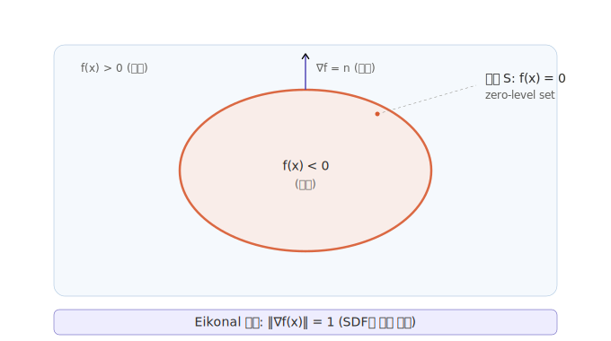
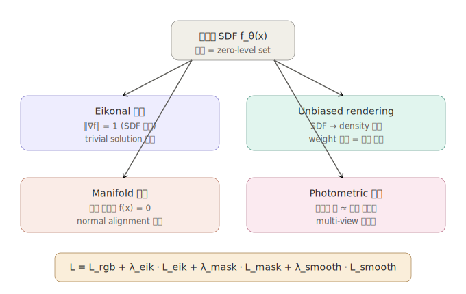
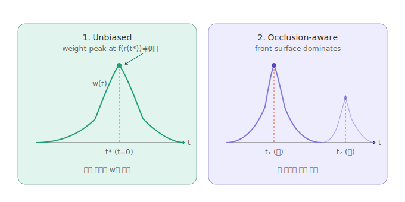

# Neural Surface Reconstruction — Surface Constraints

Neural surface reconstruction 기법에서 사용되는 **surface constraint**에 대한 수학적 정리.

2D 이미지들로부터 3D 표면을 재구성할 때, 표면을 신경망으로 표현되는 Signed Distance Function (SDF)의 zero-level set으로 정의합니다. 하지만 단순히 SDF를 학습하는 것만으로는 올바른 표면이 얻어지지 않기 때문에, 여러 surface constraint가 필요합니다.

---

## 1. 기본 표현: SDF의 Zero-Level Set

표면 $\mathcal{S}$는 MLP로 parametrize된 implicit function $f_\theta: \mathbb{R}^3 \to \mathbb{R}$의 zero-level set으로 정의됩니다:

$$\mathcal{S} = \{\mathbf{x} \in \mathbb{R}^3 \mid f_\theta(\mathbf{x}) = 0\}$$

여기서 $f_\theta(\mathbf{x})$는 점 $\mathbf{x}$에서 표면까지의 부호 있는 거리(signed distance)입니다. 내부에서는 음수, 외부에서는 양수, 표면에서는 0이 됩니다.

NeuS와 VolSDF 같은 SDF 기반 volume rendering 방법은 volume rendering과 SDF 표현을 결합합니다. density 기반 방법과 달리 기하 구조가 SDF의 zero level set으로 명확히 표현됩니다.

---

## 2. Surface Constraint의 네 가지 축

Neural surface reconstruction에서 "surface constraint"는 단일 개념이 아니라 서로 다른 차원의 제약들이 합쳐진 개념입니다.

### 2.1 Eikonal Constraint (SDF 성질 강제)

SDF가 갖춰야 할 가장 기본 수학적 성질은 **기울기의 norm이 1**이라는 것입니다. 이것은 Eikonal partial differential equation의 특수한 경우입니다:

$$\|\nabla f(\mathbf{x})\|_2 = 1, \quad \forall \mathbf{x} \in \Omega$$

신경망 $f_\theta$가 이 조건을 자동으로 만족하지 않기 때문에, Eikonal regularization term을 도입합니다 (Gropp et al., ICML 2020):

$$\mathcal{L}_{\text{eik}} = \frac{1}{N} \sum_{i=1}^{N} \left( \|\nabla f_\theta(\mathbf{x}_i)\|_2 - 1 \right)^2$$

이 조건 없이는 네트워크가 학습 중에 trivial한 zero function으로 붕괴될 수 있습니다.

**주의점**: Eikonal loss는 함수가 진짜 SDF이기 위한 필요조건이지 충분조건은 아닙니다. gradient norm이 거의 모든 곳에서 1인 함수들의 큰 동치류가 존재하므로, StEik (Yang et al., NeurIPS 2023), Viscosity Regularization 등 추가 정규화가 제안되었습니다.

### 2.2 Surface-Zero Constraint (표면 위 SDF 값 제약)

Point cloud 등 표면 샘플이 있을 때는 해당 점에서 SDF 값이 0이어야 합니다:

$$\mathcal{L}_{\text{surf}} = \sum_{\mathbf{x}_i \in \mathcal{S}} |f_\theta(\mathbf{x}_i)| + \lambda_n \sum_{\mathbf{x}_i \in \mathcal{S}} \left(1 - \langle \nabla f_\theta(\mathbf{x}_i), \mathbf{n}_i \rangle \right)$$

- 첫 항: **manifold constraint** — 표면 위의 점에서 SDF = 0
- 둘째 항: **normal alignment constraint** — SDF의 기울기가 주어진 법선과 일치

### 2.3 Unbiased & Occlusion-aware Volume Rendering

NeuS가 해결한 핵심 문제입니다. 일반적인 NeRF volume rendering은 SDF 표현에 단순히 적용할 경우 **bias**가 생겨 실제 표면 위치가 아닌 다른 곳에서 weight가 최대가 됩니다.

이미지 상의 한 픽셀 색은 ray $\mathbf{r}(t) = \mathbf{o} + t\mathbf{v}$를 따라 다음과 같이 적분됩니다:

$$C(\mathbf{r}) = \int_0^{+\infty} w(t) \, c(\mathbf{r}(t), \mathbf{v}) \, dt$$

Surface reconstruction이 정확하려면 $w(t)$가 다음 두 조건을 만족해야 합니다:

1. **Unbiased**: $f(\mathbf{r}(t^*)) = 0$인 $t^*$에서 $w$가 최대
2. **Occlusion-aware**: 앞 표면이 뒤 표면보다 큰 weight

**NeuS의 공식**: SDF $f(\mathbf{x})$가 주어졌을 때, NeuS는 **opaque density** $\rho(t)$를 다음과 같이 정의합니다:

$$\rho(t) = \max\left( \frac{-\frac{d\Phi_s}{dt}(f(\mathbf{r}(t)))}{\Phi_s(f(\mathbf{r}(t)))},\ 0 \right)$$

여기서 $\Phi_s(x) = (1+e^{-sx})^{-1}$는 sigmoid 함수이고, $s$는 학습되는 스케일 파라미터입니다. 학습이 진행되면 $s$가 증가해 표면이 점점 날카로워집니다.

이로부터 discrete weight는:

$$w_i = T_i \, \alpha_i, \quad T_i = \prod_{j<i}(1-\alpha_j)$$

$$\alpha_i = \max\left(\frac{\Phi_s(f(\mathbf{x}_i)) - \Phi_s(f(\mathbf{x}_{i+1}))}{\Phi_s(f(\mathbf{x}_i))},\ 0\right)$$

**VolSDF의 대안 공식**: VolSDF는 Laplace CDF를 사용해 SDF를 density로 변환합니다:

$$\sigma_{\text{VolSDF}}(t) = \alpha \cdot h_{\text{Laplace}}(-s f(t))$$

여기서 $\alpha$와 $\beta = 1/s$는 학습 가능한 파라미터이고,

$$h_{\text{Laplace}}(-sf(t)) = \begin{cases} \frac{1}{2}\exp(-sf(t)), & f(t) > 0 \\ 1 - \frac{1}{2}\exp(sf(t)), & f(t) \leq 0 \end{cases}$$

UNIS (Deng et al., ICCV 2025) 분석에 따르면 $\alpha = -2sf'(t)$로 설정하면 VolSDF도 NeuS와 동일한 first-order unbiasedness를 달성합니다:

$$\sigma_{\text{VolSDF-unbiased}}(t) = -2s f'(t) \, h_{\text{Laplace}}(-s f(t))$$

### 2.4 Photometric Constraint (이미지 일관성)

궁극적으로 학습 신호는 렌더링된 색과 입력 이미지 색의 차이에서 옵니다:

$$\mathcal{L}_{\text{rgb}} = \frac{1}{|\mathcal{R}|} \sum_{\mathbf{r} \in \mathcal{R}} \left\| \hat{C}(\mathbf{r}) - C(\mathbf{r}) \right\|_1$$

---

## 3. 전체 손실 함수

NeuS류의 전형적인 학습 목적 함수:

$$\mathcal{L} = \mathcal{L}_{\text{rgb}} + \lambda_{\text{eik}} \mathcal{L}_{\text{eik}} + \lambda_{\text{mask}} \mathcal{L}_{\text{mask}} + \lambda_{\text{smooth}} \mathcal{L}_{\text{smooth}}$$

전형적 하이퍼파라미터: $\lambda_{\text{eik}} = 0.1$, $\lambda_{\text{mask}} = 0.1$.

---

## 4. 왜 surface constraint가 필수적인가 — NeRF와의 대비

NeRF 같은 density 기반 장면 표현은 level set에 대한 충분한 제약이 없기 때문에 학습된 implicit field에서 고품질 표면을 추출하기 어렵습니다. 네트워크가 거의 임의의 density를 모델링할 수 있어서 의미 있는 표면이 추출된다는 보장이 없습니다.

반면 SDF + Eikonal + unbiased rendering 조합은:

- **표면 위치의 유일성**: zero-level set이 명확히 정의됨
- **기하학적 유효성**: Eikonal 조건으로 SDF의 수학적 성질 보장
- **occlusion 처리**: front surface가 back surface를 자연스럽게 가림
- **abrupt depth change에 강건**: volume rendering의 장점 계승

---

## 5. 최신 동향

- **NeuRodin** (Wang et al., NeurIPS 2024) — NeuS와 VolSDF 모두 SDF-to-density 변환에 내재된 bias 문제가 있고, NeuS는 SDF의 first-order approximation에서만 unbiased 조건을 만족함을 지적. 표준 Eikonal loss가 전체 영역에서 과도한 smoothing을 일으켜 세밀한 디테일 손실을 유발한다고 분석하며, stochastic-step numerical gradient estimation과 explicit bias correction을 제안.
- **UNIS** (Deng et al., ICCV 2025) — VolSDF, NeuS, HF-NeuS를 특수 사례로 포함하는 통합 프레임워크. 기존에 "학습 가능 파라미터"였던 양을 적절히 선택하면 first-order unbiasedness가 자연스럽게 달성됨을 보임.
- **StEik** (Yang et al., NeurIPS 2023) — Eikonal loss의 continuum 한계에서 불안정성을 이론적으로 분석하고 directional divergence regularizer 제안.

---

## 핵심 논문

| 논문 | 연도 | 기여 |
|---|---|---|
| [IGR (Implicit Geometric Regularization)](https://arxiv.org/abs/2002.10099) | ICML 2020 | Eikonal loss로 normal 없이 SDF 학습 |
| [NeuS](https://arxiv.org/abs/2106.10689) | NeurIPS 2021 | SDF 기반 unbiased volume rendering |
| [VolSDF](https://arxiv.org/abs/2106.12052) | NeurIPS 2021 | Laplace CDF로 SDF→density 변환 |
| [HF-NeuS](https://arxiv.org/abs/2206.07850) | NeurIPS 2022 | Displacement field로 high-frequency detail |
| [StEik](https://arxiv.org/abs/2305.18414) | NeurIPS 2023 | Eikonal loss의 안정성 분석 |
| [NeuRodin](https://arxiv.org/abs/2408.10178) | NeurIPS 2024 | Bias 및 over-regularization 체계적 분석 |
| [UNIS](https://openaccess.thecvf.com/content/ICCV2025/html/Deng_UNIS_A_Unified_Framework_for_Achieving_Unbiased_Neural_Implicit_Surfaces_ICCV_2025_paper.html) | ICCV 2025 | 통합 이론 프레임워크 |

---

## 수식 렌더링 노트

이 README는 GitHub에서 LaTeX 수식을 렌더링합니다. `$...$`는 inline, `$$...$$`는 display math 형식입니다.
